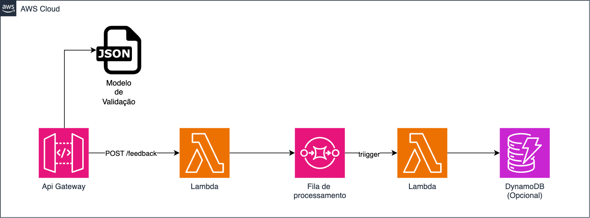

# Atividade Final - Instruções


### Descrição do Problema de Negócio
Uma empresa de e-commerce deseja melhorar o processo de atendimento ao cliente, especificamente no que diz respeito ao gerenciamento de feedbacks e reclamações. Atualmente, o processo é manual e demorado, o que resulta em uma experiência insatisfatória para os clientes e em uma sobrecarga para a equipe de atendimento.


### Objetivo
Desenvolver uma solução serverless utilizando Amazon API Gateway, AWS Lambda e Amazon SQS para automatizar o recebimento, processamento e armazenamento de feedbacks e reclamações dos clientes, melhorando a eficiência do atendimento e a satisfação dos clientes.



##### Requisitos do Sistema

1. Recebimento de Feedbacks/Reclamações:

   - Criação de uma API RESTful usando Amazon API Gateway para receber feedbacks/reclamações dos clientes.
   - A API deve aceitar solicitações HTTP POST com detalhes do feedback/reclamação, como ID do cliente, descrição, categoria (elogio, reclamação, sugestão), e data/hora.

2. Processamento de Feedbacks/Reclamações:

   - Utilização de AWS Lambda para processar as solicitações recebidas pela API.
   - A Lambda deve validar os dados da solicitação e, em seguida, enviar os detalhes para uma fila SQS para processamento posterior.

3. Armazenamento e Notificação:

   - Implementação de outra função Lambda que será desencadeada pela fila SQS.
   - Esta Lambda deve armazenar os detalhes do feedback/reclamação em um banco de dados (por exemplo, Amazon DynamoDB) e enviar uma notificação para a equipe de atendimento via email ou outro serviço de notificação.


##### Passos para Implementação

1. Configuração do Amazon API Gateway:

   - Crie uma nova API RESTful no Amazon API Gateway.
   Defina um endpoint HTTP POST para receber os feedbacks/reclamações.
   - Configure a integração com a função AWS Lambda que processará a solicitação.
   - Valide as chamadas via json schema diretamente no gateway.

2. Desenvolvimento da Função AWS Lambda (Recebimento e Validação):

   - Crie uma função Lambda que será invocada pelo API Gateway.
   - Envie os dados válidos para uma fila SQS.

3. Configuração do Amazon SQS:

   - Crie uma fila SQS para armazenar os feedbacks/reclamações recebidos.
   - Anote a URL da fila para uso na função Lambda.
  
4. Desenvolvimento da Função AWS Lambda (Processamento e Armazenamento):

   - Crie uma função Lambda que será acionada pelas mensagens na fila SQS.
   - A função deve armazenar os dados em um banco de dados como o DynamoDB e enviar uma notificação.


#### Exemplos de chamada da API

```json

{
    "id_cliente": "12345",
    "descricao": "O produto chegou com defeito e não funciona corretamente.",
    "categoria": "reclamação",
    "data_hora": "2024-07-29T14:48:00Z"
}
``` 
```json
{
    "id_cliente": "67890",
    "descricao": "Gostei muito do atendimento rápido e eficiente!",
    "categoria": "elogio",
    "data_hora": "2024-07-29T15:00:00Z"
}
```

```json
{
    "id_cliente": "54321",
    "descricao": "Seria ótimo se vocês pudessem oferecer mais opções de cores para este produto.",
    "categoria": "sugestão",
    "data_hora": "2024-07-29T16:30:00Z"
}
```

##### Como criar APIs via serverless framework

```yaml
# serverless.yml
functions:
  hello:
    handler: handler.hello
    events:
      - http:
          path: hello
          method: post
          cors: true
```


##### Como adicionar modelos de validação em json schema no serverless framework

[documentação - request-schema-validators](https://www.serverless.com/framework/docs/providers/aws/events/apigateway#request-schema-validators)

```yaml
functions:
  create:
    handler: posts.create
    events:
      - http:
          path: posts/create
          method: post
          request:
            schemas:
              application/json: ${file(create_request.json)}
```

#### Dicas

- Lembre de validar o conteúdo da requisição via Json Schema e que o campo categoria pode reseceber apenas 3 valores (elogio, reclamação, sugestão).
- Lembre de não permitir que propriedades não descritas no json schema sejam aceitas na requisição e validar os campos obrigatórios.
- Todos os códigos de exemplo estão disponíveis no repositório do GitHub em python, mas caso deseje, pode utilizar outra linguagem de programação disponivel para AWS Lambda.
- A atividade pode ser desenvolvida totalmente em serverless framework ou utilizando a console da AWS. Recomendo que utilize serverless framework para facilitar a criação e deploy das funções Lambda e suas triggers.

#### Atividades Extras para o desafio

## 10 Sugestões de Implementações Extras para o Desafio Serverless (Respeitando Limitações do Academy)

---

### 1. **Validação de Payload com JSON Schema no API Gateway**
- **Descrição:** Adicione validação de payloads de requisições usando JSON Schema Models diretamente no API Gateway, rejeitando automaticamente dados inválidos antes de chegar à Lambda. Valido para novos endpoints.
- **Pontuação:** 15 pontos
- **Referência:** [2][4][6]

---

### 2. **Proteção de Endpoints com Chaves de API (API Keys)**
- **Descrição:** Configure API Keys e Usage Plans no API Gateway para controlar e monitorar o acesso aos endpoints, exigindo que clientes forneçam uma chave válida. Valida uma chave de API para novos endpoints criados.
- **Pontuação:** 12 pontos
- **Referência:** [3][5]

---

### 3. **Criação de Novos Paths/Recursos na API**
- **Descrição:** Implemente novos endpoints REST (ex: `/clientes`, `/relatorios`, `/status`) e associe-os a novas funções Lambda, ampliando a funcionalidade do sistema.
- **Pontuação:** 10 pontos
- **Referência:** [1]

---

### 4. **Validação de Parâmetros de Path e Query String**
- **Descrição:** Defina validações para parâmetros de rota e query string no API Gateway, usando modelos e restrições de tipos/valores. Valido para novos endpoints criados que utilizem parâmetros de path ou query string.
- **Pontuação:** 10 pontos

---

### 5. **Implementação de Limite de Taxa (Throttling) por Usage Plan**
- **Descrição:** Defina limites de requisições por minuto/hora para diferentes chaves de API, evitando abuso e protegendo recursos. Valido um por grupo.
- **Pontuação:** 12 pontos

---

### 6. **Resposta Customizada para Erros de Validação**
- **Descrição:** Configure mensagens de erro customizadas para falhas de validação de payload, melhorando o feedback ao usuário. Valido para mensagens de erro que podem ser mostradas na demo
- **Pontuação:** 8 pontos
- **Observação:** API Gateway permite customização limitada, mas é possível definir mensagens genéricas[4].

---

### 7. **Integração de Lambda com DynamoDB para Novos Recursos**
- **Descrição:** Crie funções Lambda extras para manipular novos tipos de dados em tabelas DynamoDB (ex: logs de acesso, histórico de operações).
- **Pontuação:** 10 pontos

---

### 8. **Implementação de Endpoint para Exportação de Dados (S3)**
- **Descrição:** Adicione um endpoint que exporta registros do DynamoDB para um arquivo CSV em um bucket S3, usando Lambda.
- **Pontuação:** 15 pontos

---

### 9. **Envio de Notificações via SNS em Eventos Específicos**
- **Descrição:** Configure Lambda para publicar mensagens em um tópico SNS ao detectar eventos importantes (ex: criação de ordem crítica).
- **Pontuação:** 10 pontos

---

### 10. **Documentação Automática dos Endpoints (Swagger/OpenAPI)**
- **Descrição:** Utilize o recurso de documentação do API Gateway para descrever cada endpoint, parâmetros, modelos de resposta e exemplos, facilitando o uso da API por terceiros. Valida uma automação para toda a API. Tem que apresentar a demo no swagger UI
- **Pontuação:** 8 pontos

---

## Tabela Resumida

| Sugestão                                              | Pontuação |
|-------------------------------------------------------|-----------|
| Validação de Payload com JSON Schema                  | 15        |
| Chaves de API e Usage Plans                           | 12        |
| Novos Paths/Recursos na API                           | 10        |
| Validação de Parâmetros de Path/Query                 | 10        |
| Limite de Taxa por Usage Plan                         | 12        |
| Resposta Customizada para Erros de Validação          | 8         |
| Lambda+DynamoDB para Novos Recursos                   | 10        |
| Endpoint de Exportação de Dados para S3               | 15        |
| Notificações via SNS                                  | 10        |
| Documentação Automática dos Endpoints                 | 8         |


Citações:
- [1] https://forum.serverless.com/t/put-methods-under-existing-api-in-aws-api-gateway/2985
- [2] https://www.fernandomc.com/posts/schema-validation-serverless-framework/
- [3] https://www.serverless.com/plugins/serverless-add-api-key
- [4] https://www.serverlessguru.com/blog/request-validation-with-api-gateway-models
- [5] https://forum.serverless.com/t/creating-api-keys/847
- [6] https://blog.codeops.tech/validate-your-api-request-at-the-api-gateway-using-serverless-framework
- [7] https://www.serverless.com/framework/docs/providers/aws/guide/intro
- [8] https://aws.plainenglish.io/the-serverless-trap-5-aws-lambda-limitations-they-dont-tell-you-about-1dcc45232cc4
- [9] https://docs.databricks.com/aws/en/compute/serverless/limitations
- [10] https://www.serverless.com/framework/docs/providers/aws/events/apigateway
- [11] https://forum.serverless.com/t/how-do-you-add-a-request-validator-to-api-gateway/12923
- [12] https://forum.serverless.com/t/response-schema-validators/8870
- [13] https://newrelic.com/blog/best-practices/what-is-serverless-architecture
- [14] https://gbh.tech/challenges-of-implementing-a-serverless-architecture/
- [15] https://www.reddit.com/r/serverless/comments/1b8zc51/senior_developers_i_know_are_always_hating_on/
- [16] https://techdocs.broadcom.com/us/en/ca-enterprise-software/layer7-api-management/api-gateway/10-1/policy-assertions/assertion-palette/message-validation-transformation-assertions/validate-json-schema-assertion-message-validation-transformation.html
- [17] https://cloud.google.com/api-gateway/docs/authenticate-api-keys
- [18] https://aws.amazon.com/marketplace/pp/prodview-3mpatxr6fwcca
- [19] https://sst.dev/examples/how-to-create-a-rest-api-with-serverless.html
- [20] https://www.serverless.com/plugins/serverless-apigateway-route-settings